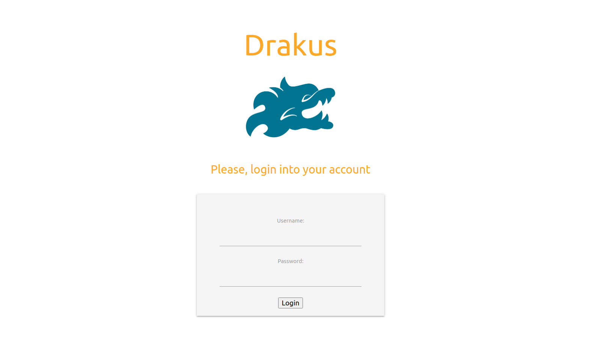
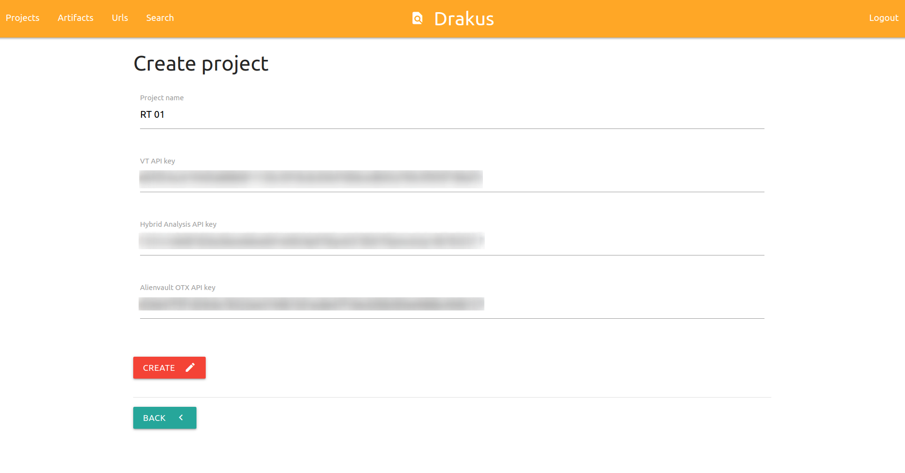
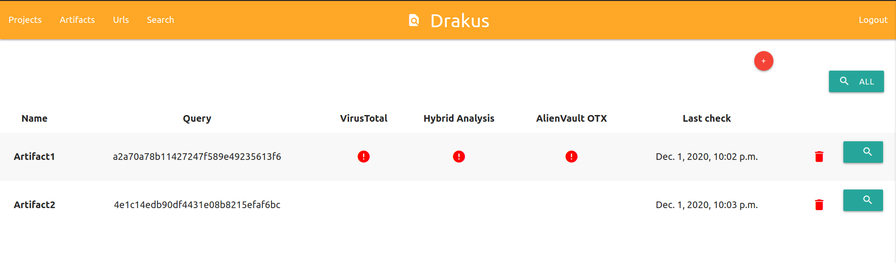
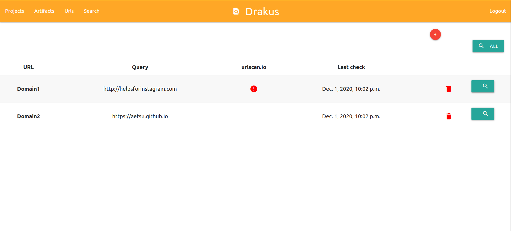
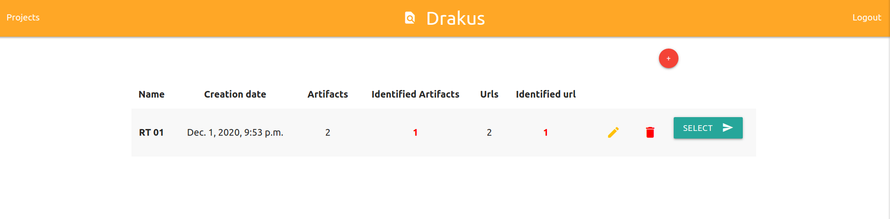
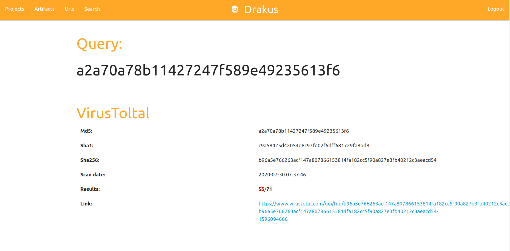

# Drakus - Artifact Monitoring Tool
**Drakus** allows you to monitor the artifacts and domains used in a Red Team exercise to see if they have been uploaded to certain online malware analysis services.


Artifacts are queried at (requires a free API key):  
- Virustotal: [https://www.virustotal.com](https://www.virustotal.com)  
- Hybrid Analysis: [https://www.hybrid-analysis.com](https://www.hybrid-analysis.com/)  
- AlienVault OTX: [https://otx.alienvault.com](https://otx.alienvault.com)  
  
The domains are queried at:  
- Urlscan.io: [https://urlscan.io](https://urlscan.io)  
  
Queries can be made manually and automatically every 120 minutes (it's possible to change the time in *drakus/setting.py*).

## Installation
Install with virtualenv:
```bash
python3 -m venv venv
source venv/bin/activate
pip3 install -r requirements.txt
```

Initialize the database:
```
python3 manage.py makemigrations watcher
python manage.py migrate
```
Create an admin user (it's possible to create more users from the admin panel):
```
python manage.py createsuperuser
```

## Running drakus
Launch server:
```bash
python manage.py runserver

Performing system checks...

System check identified no issues (0 silenced).
December 01, 2020 - 22:49:35
Django version 3.0.8, using settings 'drakus.settings'
Starting development server at http://127.0.0.1:8000/
Quit the server with CONTROL-C.
```

## Images
- Login page:

- Create project form:

- Project list:

- Artifact list:

- Url list:

- Search form:
